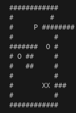
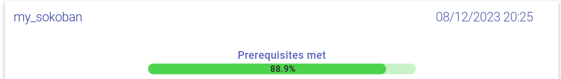

## My Sokoban

file representing the warehouse mapcontaining ‘#’ for walls,
for the player, ‘X’ for boxes and ‘O’ for storage locations.

The basic rules for the sokoban are as follows:
- The game must be able to be played with the arrow keys (LEFT, RIGHT, UP and DOWN).
- A valid map can only contains the characters SPACE, ‘\n’, ‘#’, ‘X’, ‘O’ and ‘P’.
If an invalid map is supplied, the program must exit with an error
A valid map can only contains the characters SPACE, ‘\n’, ‘#’, ‘X’, ‘O’ and ‘P’.
If an invalid map is supplied, the program must exit with an error

## Usage
```
make && ./my_sokoban
```

## Help
```
./my_sokoban -h
```

## Results screen



## Automatics tests
